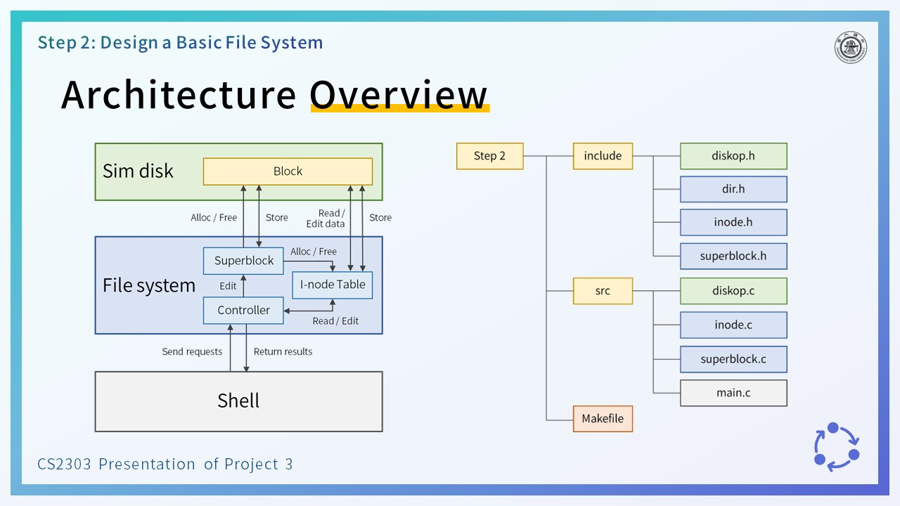
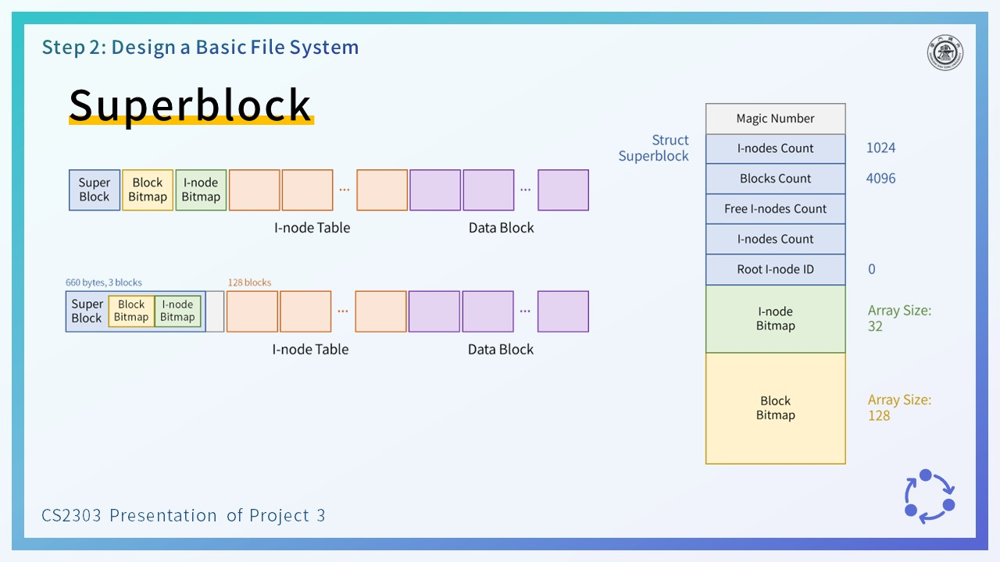
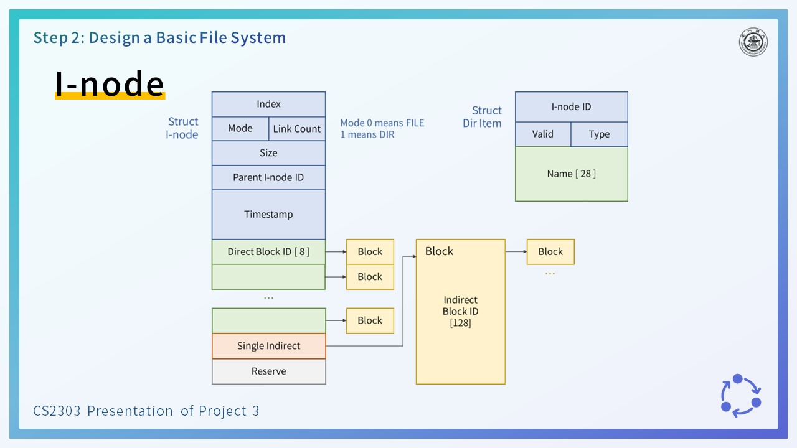
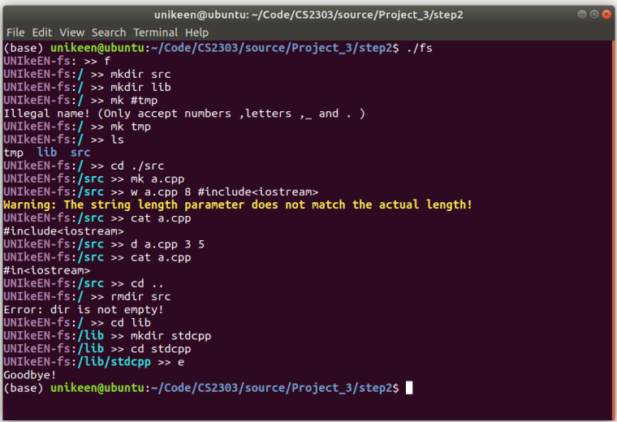
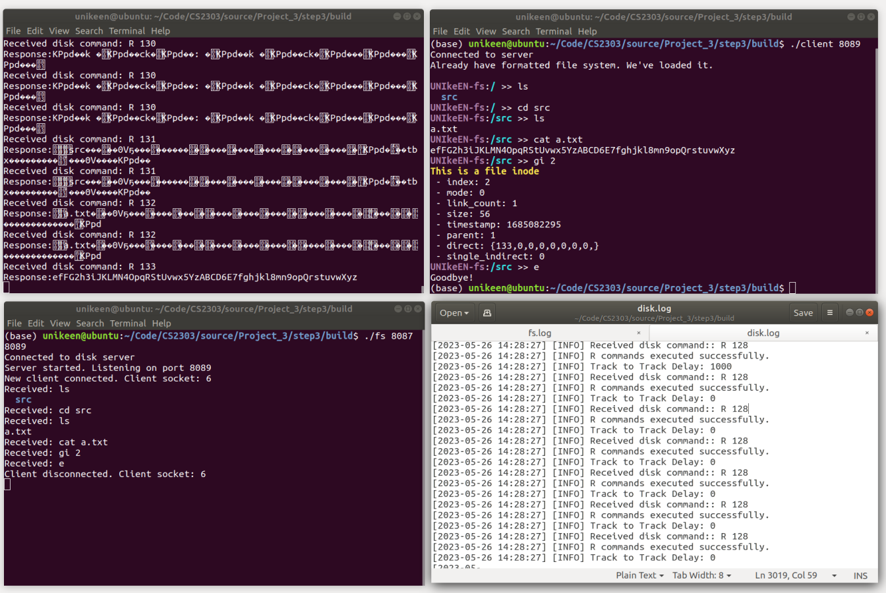

# SJTU CS2303 Project 3: A simple File System

UNIkeEN, 2023 Spring

## Desctiption

这是上海交通大学操作系统课程设计的项目三：文件系统。按题目要求（见`problem set.pdf`）分为三步：实现磁盘系统、实现文件系统、使用socket连接两者。

本项目借鉴了linux的ex2文件系统，自行设计了superblock和inode，但由于时间仓促，许多细节处性能仍值得优化。具体的实现细节请见报告（见`report.pdf`）

According to the requirements of the question (see `problem set. pdf`), there are three steps: implementing a disk system, implementing a file system, and connecting the two using sockets. 

This project drew inspiration from Linux's EX2 file system and designed superblock and inode, but due to time constraints, many details of performance are still worth optimizing. Please refer to the report (see `report.pdf`) for specific implementation details.

 

 

 

## Build

You can use the `make` command in the root directory to compile all three step programs, or you can use the makefiles in each of the three step sub folders to compile them separately.
The compiled executable file of step3 will be located in the `step3/build/` directory

## Usage

### Step 1

```shell
./disk <cylinders> <sector per cylinder> <track-to-track delay> <disk-storage-filename>
```

* cylinders: Cylinder number of your simulated disk.

* sector per cyclinder: Sector number per cylinder of your simulated disk.

* track-to-track delay: Time in milliseconds to simulate the movement of the magnetic head

* disk-storage-filename: File name that store disk data.

### Step 2

```shell
./fs
```

### Step 3

```shell
./disk <cylinders> <sector per cylinder> <track-to-track delay> <disk-storage-filename> <DiskPort>

./fs <DiskPort> <FSPort>

./client <FSPort>
```

The input commands supported after startup all meet the required format. 

In steps 2 and 3, two debug instructions are also provided to view the inode information and block data of the specified number, respectively:

```shell
gi <inode id>
gb <block id>
```

## Screenshots

 

 

## Code Structure
```
.
├── Makefile            # Makefile that makes all 3 steps out
├── report.pdf          # report
├── step1               # source code of step1
│   ├── disk.c
│   └── Makefile
├── step2               # source code of step2 (refer to the report for details)
│   ├── include
│   │   ├── dir.h
│   │   ├── diskop.h
│   │   ├── inode.h
│   │   └── superblock.h
│   ├── Makefile
│   └── src
│       ├── diskop.c
│       ├── inode.c
│       ├── main.c
│       └── superblock.c
├── step3               # source code of step3
│   ├── build
│   ├── client
│   │   └── client.c
│   ├── disk
│   │   └── disk.c
│   ├── fs
│   │   ├── include
│   │   │   ├── dir.h
│   │   │   ├── diskop.h
│   │   │   ├── inode.h
│   │   │   └── superblock.h
│   │   └── src
│   │       ├── diskop.c
│   │       ├── inode.c
│   │       ├── main.c
│   │       └── superblock.c
│   └── Makefile
└── README.md
```
